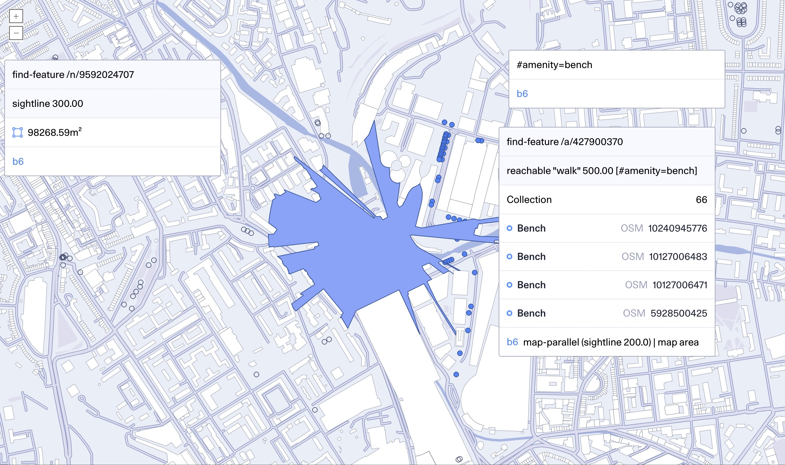

# b6

Bedrock, or [b6](https://diagonal.works/b6), is Diagonal's geospatial analysis
engine. It reads a compact representation of the world into memory, and
makes it available for analysis, for example from a Python script or iPython
notebook. It also provides a simple web interface for exploring data. Communication between Python and b6 happens over
[GRPC](https://grpc.io).

We use b6 for the analysis behind our
[work for clients](http://diagonal.works/journal). We use the web interface
to explore data at the outset of a project, before generating analysis
results for different scenarios as JSON. We load these results into
interactive visualisations and tools built with [d3](https://d3js.org/).
When working with larger datasets, or building more complex tools, we embed
the [Go library](src/diagonal.works/b6/world.go) into custom
binaries to build tools that support dynamic analysis.

Working in the urban environment, the impact of the projects we support on
the communities around them outlasts our own involvement. We have a duty to
allow these communities to understand and build on our work beyond our time
with the project. We open sourced b6 to enable this - and to comply with our
[charter](http://diagonal.works/charter), which requires our work to be
 transparent.

We built b6 for ourselves, and don't expect it to be useful for a wide range
of people. We don't have as much public documentation as we'd like yet.
However, if you do find it useful, or interesting, we'd be excited to [hear
about what you're up to](mailto:hello@diagonal.works).

## Quickstart

The simplest way to try b6 is with the docker package we provide:

```
docker run -p 8001:8001 -p 8002:8002 europe-docker.pkg.dev/diagonal-public/b6/b6
```

This starts an instance of b6, with a web interface on port 8001, and
a GRPC interface for analysis from Python on port 8002, hosting a small amount
of data from OpenStreetMap for the area of London around
[Diagonal's spiritual home](https://www.dishoom.com/kings-cross/). Viewing
[localhost:8001](http://localhost:8001) should show you a map.

To try out analysis, you'll need to install the Python client library, via:

```
python -m pip install diagonal_b6
```

There's a [Python notebook](python/docs/01_Search.ipynb) that introduces the
client library, and an overview b6 concepts in our
[FOSS4G 2023 talk](https://diagonal.works/foss4g-2023). The
[unit tests](python/diagonal_b6/b6_test.py) are the best place to discover the
functions b6 provides, and see how they're used.

## The web interface, and the b6 shell



In the web interface, a left click will show a result window for the lat, lng
of that location. Holding shift while left clicking will show a result window
with the feature rendered on the map at that location. The result window can
be dragged if you'd like to keep it around, otherwise it will be replaced by
the next click.

There's an input box labelled _b6_ at the bottom of each result window. We call
this the b6 shell. The shell lets you enter a b6 function to run on the value
shown in the result window. For example, clicking a point on the map to show
the lat, lng and entering `sightline 300` will show an estimated viewshed
polygon from that point, with a cutoff of 300m. The Python client library and
the shell provide the same set of functions.

Pressing backtick will slide open a b6 shell that's not associated with a
result. This is a good starting point for jumping to new locations and finding
data. Entering `51.537028, -0.128169` will jump the map to a pocket park.

You can search for features by tags that start with a `#`. For example,
`find (tagged "#amenity" "bench")` will show places to sit. `find` returns
feaures matching a query, and `tagged` returns a query that will match
features by tag value. As searching is so common, the shell provides a shorthand
for queries: `find [#amenity=bench]`. `find` will highlight the matching
features on the map, if they're shown. A result window for a tag will add
features with that tag to the map, so if you'd like to see benches, enter
`#amenity=bench` (which is shorthand for `tag "#amenity" "bench"`), and drag
the window to keep it around. (To close windows, you have to reload the UI -
it's a work in progress!).

We often restrict searches to a radius around a location.
`find (and (intersecting-cap 51.537028, -0.128169 500) [#building])` will
return buildings within 500m of the park.

Nesting brackets in the shell quickly becomes tedious, so we provide a shorthand
for piplining functions with `|`, which calls the next function the result of
the current call as the first argument. `take (find [#amenity=bench]) 10`, which
returns the first 10 benches ordered by ID, can be written as
`find [#amenity=bench] | take 10`. When you use the shell at the bottom of
a result window, you're adding to a pipeline that starts with the result in the
window.

## Ingesting data

If you have a small amount of data you'd like to work with, in OSM PBF format,
you can read it directly by putting it in a directory by itself and replacing
the `/world` directory in the image. b6 tries to read all files in that
directory:

```
docker run -v /path/with/data:/world -p 8001:8001 -p 8002:8002 europe-docker.pkg.dev/diagonal-public/b6/b6
```

For larger datasets, or datasets in formats other than OSM PBF, you'll need to
use one of the [ingestion tools](src/diagonal.works/b6/cmd) from either the
docker image. These tools convert source data into a compact representation for
efficient reading by the backend, that we call an index. `b6-ingest-osm`
produces an index for OpenStreetMap data in PBF format, while `b6-ingest-gdal`
will produce an index for anything the GDAL library can read. We typically use the `.index` extension for ingested data.

To ingest an OSM PBF file `granary-square.osm.pbf`, use:

```
b6-ingest-osm --input=granary-square.osm.pbf --output=granary-square.index
```

You can find binaries for our ingest tools for Linux in our [release assets](https://github.com/diagonalworks/diagonal-b6/releases). We provide binaries for [amd64](https://github.com/diagonalworks/diagonal-b6/releases/download/v0.0.3/diagonal-linux-amd64-0.0.3.tar.gz) and [arm64](https://github.com/diagonalworks/diagonal-b6/releases/download/v0.0.3/diagonal-linux-arm64-0.0.3.tar.gz). We don't think the project is mature enough yet to provide packages for
`apt` or `brew`. You can also run the ingest tools within docker, for example:

```
docker run --rm -v ${PWD}:/data europe-docker.pkg.dev/diagonal-public/b6/b6 /diagonal/bin/b6-ingest-osm --input=/data/granary-square.osm.pbf --output=/data/granary-square.index
```

To ingest a shapefile via GDAL, use something like:

```
b6-ingest-gdal --input=SG_DataZone_Bdry_2011.shp --output=data/region/scottish-borders/data-zones-2011.index --namespace=maps.scot.gov/data-zone-2011 --id=DataZone --id-strategy=strip "--add-tags=#boundary=datazone" --copy-tags=name=Name,code=DataZone,population:2011=TotPop2011
```

In this example:

  * `--input` is the name of the GDAL readable file to ingest.
  * `--namespace` is the namespace to use when generating IDs for features.
  * `--id=DataZone --id-strategy=strip` uses the value of the `DataZone` field
     as the integer part of the feature's identifier, stripping non-numeric
     characters from the field's value. Another common option is
     `--id=Code --id-strategy=hash`, which hashes the value of the `Code`
    field. If `--id-strategy` isn't supplied, an ID is generated by
    incrementing an integer for each ingested feature.
  * `--copy-tags=name=Name` copies the `Name` field into the feature as a
    tag named `name`.
  * `--add-tags=#boundary=datazone` adds the tag `#boundary=datazone` to all
    features.

Indexing large inputs takes time and memory, but results in a reasonably
sized index file. For example, indexing a 10Gb planet extract for
the UK takes ~20 minutes on a machine with 8 cores, and uses ~40Gb RAM. The
resulting index is around 10Gb. As the index is mapped directly into memory,
the size of the file is the upper bound on the amount of memory b6 will use
to read the index. We normally ingest large datasets on cloud VMs, but
use the index on our own machines.


## Building and running from source

You only need to build b6 from source if you're planning to change it. We
depend on the [protocol buffer](https://protobuf.dev/) compiler, and
[npm](https://www.npmjs.com/) at build time. To ingest and reproject data from
shapefiles, we depend on [gdal](https://gdal.org/), though it's not required
when working with OpenStreetMap, and we don't use it at run time. To install these on an Ubuntu based system, for example:
```
apt-get install npm protobuf-compiler gdal-bin libgdal-dev
```
or on OSX, using [brew](http://brew.sh):
```
brew install protobuf gdal
```
We also require Python >= 3.10 and Go >= 1.20.

To build all binaries, including data ingestion with gdal:
```
make
```

To build just the b6 backend, and OpenStreetMap ingestion, without gdal:
```
make b6 b6-ingest-osm
```
To generate the sample world data included in the docker image (replace the platform as appropriate):
```
bin/linux/x86_64/b6-ingest-osm --input=data/tests/camden.osm.pbf --output=data/camden.index
```
To start the backend:
```
bin/linux/x86_64/b6 --world=data/camden.index
```
You can run the entire build inside a docker container with:
```
make docker/Dockerfile.b6
docker build --build-arg=TARGETOS=linux --build-arg=TARGETARCH=amd64 -f docker/Dockerfile.b6 .
```


### Building with Nix

A [Nix](https://nixos.org/) [flake](https://nixos.wiki/wiki/flakes) is
provided to build the binaries and/or do development.

If you use [direnv](https://direnv.net/) you will get a development shell
automatically, and otherwise you can get one with:

```shell
nix develop
```

You can build the go binaries with `nix build` and run the `b6` binary with
`nix run . -- --help`. You can find the rest of the binaries in `./result/bin`
(if you have called `nix build`.)

The go application is built with [gomod2nix](https://github.com/nix-community/gomod2nix/).

For day-to-day development, it is convenient to use the Makefile; so you can
run `make b6`, or any other make target, from the Nix shell and it should work
fine. Note that the resulting binaries are placed in the `./bin` folder; but
they should (!) be identical to the ones built by Nix; or at least, they are
built from the same source!

The JavaScript projects are all managed by npm; invoked also in the devShell.

There is a Python project defined which can be built with `nix build
.#python`; but this is probably only useful as a flake input to another
project, and not really used here at present.
